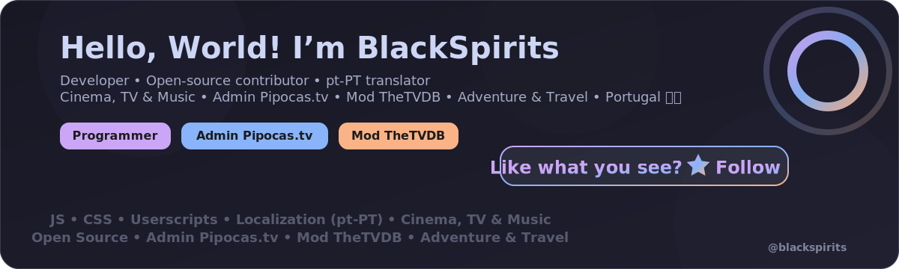

  <a href="https://github.com/BlackSpirits?tab=followers" target="_blank" rel="noopener noreferrer">
    <picture>
      <source srcset="./assets/profile-hero.webp" type="image/webp" />
      
    </picture>
  </a>

<h3 align="center">Born to explore. Coded to connect. 🌍</h3>

  

  

  

  

  

  
  
  
  
  
  
  

  

## 🧑‍💻 About Me

🎯 💻 Programmer, technology enthusiast and open-source contributor  
📝 Translator and reviewer for several projects in European Portuguese (pt-PT)  
🌐 I develop and maintain [Pipocas.tv](https://pipocas.tv) and contribute as a moderator at [TheTVDB](https://www.thetvdb.com)  
🎬 Passionate about the Seventh Art — from classic cinema to modern streaming series  
📍 Based in Portugal

👉 **[Visit my personal site: blackspirits.github.io](https://blackspirits.github.io)**

## 🛠️ Core Focus

  
  
  
  

## 🧩 Featured Projects

🧠 **UserScripts & UserStyles**  
A collection of userscripts and userstyles created and maintained by me, shared with the open-source community, and focused on automation, media workflows, UX improvements, and productivity.

  

  

## 💡 Did you know?
- 🎬 I watch over 100 movies and TV series every year — from timeless classics to fresh releases
- 💻 I love tweaking code for fun
- 🌍 I'm obsessed with perfect localization (pt-PT ❤️)
- 🗣️ Currently learning Korean —  한글 배우는 중!

  

## 🎞️ Recently Watched

  Curious about what I'm currently watching? 
  Movies, TV shows, and more — all on my Simkl profile.

  

  

## 📊 GitHub Stats

  

  

  

## 📈 GitHub Activity

  

## 🎧 Vibe & Support

  
<em>Stay creative. Keep coding.</em>

  
  
    
  
  

  

  Thanks for visiting my profile!  
  Feel free to explore, contribute — or just say hi 👋

<a href="#readme">↑ Back to top</a>

