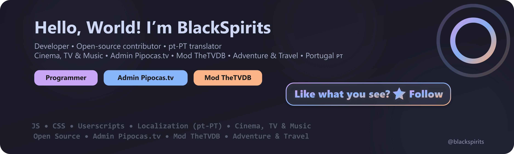

  <picture>
    <source srcset="./assets/profile-hero.svg" type="image/svg+xml" />
    
  </picture>

<h3 align="center">Born to explore. Coded to connect. 🌍</h3>

  
  &nbsp;
  
  &nbsp;
  
  &nbsp;
  
  &nbsp;
  

---

## 🧑‍💻 Who I Am

🎯 Programmer, technology enthusiast and open-source contributor  
📝 Translator and reviewer for several projects in **European Portuguese (pt-PT)**  
🎬 Passionate about the Seventh Art — from classic cinema to modern streaming series  
📍 Based in **Portugal**

👉 **[Visit my personal site: blackspirits.github.io](https://blackspirits.github.io)**

  

## 🔨 What I Build

**Languages**

**Frameworks & Tools**

**Core Focus**

  

## 🧩 Featured Projects & Contributions

🧠 **UserScripts & UserStyles**  
A collection of userscripts and userstyles created and maintained by me — focused on automation, media workflows, UX improvements, and productivity.

  

 <strong>Pipocas.tv</strong> 
Portuguese subtitles community platform — I develop, maintain, and moderate this community-driven project.

  

📺 **TheTVDB Moderation**  
Contributing as a moderator, helping maintain the accuracy and completeness of TV metadata for Portuguese titles.

  

  

## 🎞️ Recently Watched

  

  

  Auto-updated daily via GitHub Actions · <a href="./.github/workflows/simkl-recently-watched.yml">workflow</a>

  

## 💡 Did you know?

- 🎬 I watch over 100 movies and TV series every year — from timeless classics to fresh releases
- 💻 I love tweaking code for fun — the best bugs are the ones you make yourself
- 🌍 I'm obsessed with perfect localization (pt-PT ❤️)
- 🗣️ Currently learning Korean —  한글 배우는 중!

  

## 📊 GitHub Stats

  

  

  

  

  

## 📈 GitHub Activity

  

## 🎧 Vibe & Support

*Stay creative. Keep coding.*

 

  

If you find my work useful, a coffee goes a long way ☕

&nbsp;

&nbsp;

&nbsp;

  

  Thanks for visiting! Feel free to explore, contribute — or just say hi 👋

<a href="#top">↑ Back to top</a>

